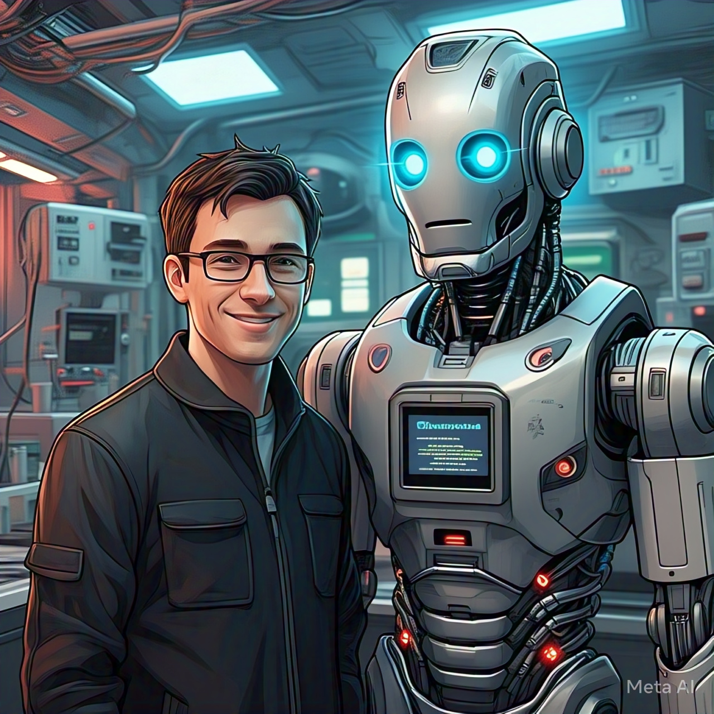
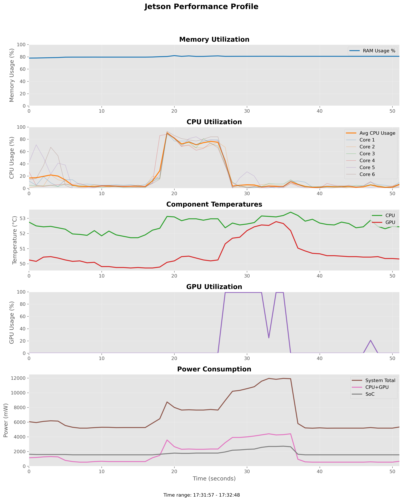

# 🤖 ChatBots!

## 📋 Overview

Chatemis is a specialized conversational AI system being developed for RoMeLa's advanced robotic platforms, including the humanoid robots **ARTEMIS** and **COSMO**, **DARWIN**, and any other cool robots. 

The system implements a **retrieval-based architecture** that enables robots to engage in natural and informative conversations during laboratory demonstrations (*completely offline!*).

By leveraging a knowledge base built from alumni theses and research publications specific to each robot, the system allows robots to provide **accurate, technical responses** while maintaining engaging interactions with visitors. Here's a video demo of the fully offline system in action:
<div align="center" style="display: flex; justify-content: center; align-items: center; gap: 40px; margin: 30px 0; flex-wrap: wrap;">
  <div style="width: 45%; min-width: 300px; max-width: 500px;">
    
    <p><em>Building bridges between humans and machines, one conversation at a time. AI generated :)</em></p>
  </div>
  <div style="width: 45%; min-width: 300px; max-width: 500px; align-self: center;">
    <a href="https://youtu.be/6y75UbYwfy0">
      
    </a>
    <p><em>👆 Click the image above to watch the fully offline interaction with BRUCE.</em></p>
  </div>
</div>

## 💻 System Requirements

- **Ubuntu 22.04 LTS** <em>(recommended)</em>
- **Python 3.10.12** <em>(or newer)</em>
- **CTK 12.6**
- **nvidia-jetpack** (6.0+b106)

## 🔧 Hardware Components 

- **Jetson Orin Nano + Audio Case** (if you want us to release the CAD for the cute case, let us know! 😊)
- [Waveshare Audio Card for Jetson Nano](https://www.waveshare.com/audio-card-for-jetson-nano.htm) -
 USB audio codec designed specifically for Jetson Nano that provides audio input/output capabilities.
  We have **validated** that this can also work for a Jetson Orin Nano.


## ⚡ Quick Start

### 1️⃣ Audio Source Check

In the "Sound" tab:

- ✅ Ensure the "**Output Device**" is set to "Speakers - USB PnP Audio Device."
- ✅ Ensure the "**Input Device**" is set to "Microphone - USB PnP Audio Device."

### 2️⃣ Environment Setup

Create and activate a Python virtual environment in the root of the project:

```bash
python -m venv jetsonchat
source jetsonchat/bin/activate
```

Install dependencies:
```bash
chmod +x misc/*.sh
./misc/install.sh
```

### 3️⃣ Audio System verification
Test your audio setup before running the main application:

```
python ./scripts/audio_mic_test.py
```

### 4️⃣ Initial configuration

1. Generate the vector database (first-time setup). It might take a long time depending on the size of your documents. Luckily, this will be done only once, be patient and let it run:
```
python scripts/tokenizer.py
```
 > ⏳ It might take a **long time** depending on the size of your documents. This will be done **only once**, 
 so be patient and let it run.

 > 📝 **Note**: Ensure your RAG data is in the data folder before running this command. For this example, we included one paper related to our robot BRUCE (Bipedal Robotic Unit with Compliant Enhanced locomotion).

2. Download an LLM model:
- Select a model **compatible with ollama CUDA 🦙**: https://ollama.com/search
- Write the name of the model in config.yaml in the "model" field

Check the models that are available through ollama with this command
```bash
ollama list
```
and then pull the one of your preference with this (example - the best one so far for this application)
```bash
ollama pull llama3.2:3b
```
> 🔌 After this, you can run it **completely offline**!

3. **Adjust parameters** in config.yaml according to your application:

|**Parameter** | **Description** |
   | --- | --- |
   | `mode` | Set to "k" for keyboard input or "v" for voice interaction |
   | `model` | Choose "Llama2.3" for balance, "TinyLlama" for speed, or "DeepSeek" for quality |
   | `word_count` | Controls response length (15-20: concise, 30-40: detailed) |
   | `chunk_size` | Affects RAG precision (smaller: 300-400) vs. context (larger: 600-1000) |


4. Start the main application:
```
python main.py 
```

## 🐳 Docker Deployment

### **If you are using Docker**

(Optional) Make sure that your user is added to the docker group, otherwise there might be permission problems with the audio card
```bash
sudo usermod -aG docker $USER
```
> 🔄 **Remember to reboot** after this change!

1. Open the Dockerfile and change "data.pdf" to the actual name of your PDF in the "data" folder and comment/uncomment lines as needed for tokenization.

2. Run the following command to build the Docker environment for the first time:
```bash
docker build -t jetsonchat .
```

3. Run the following command to start the Docker container with required pulseaudio information:
```bash
docker start chatemis
```

4. Run the script to create and start the container for the first time or when you want to execute it again:
```bash
./misc/docker_run.sh
```

5. Repeat the tokenization process, check the audio and then run the main python script! 

> ⚠️ **Warning**: Unless you want your Jetson becoming your roommate's 3 AM conversation partner, remember to **stop that container**! 😆

## 📊 Performance Profiling 

During testing with the `Llama3.2:2b` model, the system was asked:

> <strong> User </strong>: <em>"What is your name? What are you?"</em>

> <strong> Response </strong>:  <em>"My name is BRUCE, and I am a miniature bipedal robot with proprioceptive actuation.
 I'm designed to perform highly dynamic motions like those of a human's lower body, while also being able to interact with 
 unstructured environments through my contacts sensing capabilities."</em>

The response was generated in ~30 seconds, with a clear **GPU utilization spike** visible in the performance graph 
below at 25 seconds (check GPU utilization). This highlights the computational load of offline LLM inference on the 
Jetson Orin Nano while maintaining responsive interactions.
We encourage you to test **different large language models** and compare responses for the same questions!

<div align="center">
  
  <p><em>📈 Peak GPU utilization during LLM inference (~30s response time) based on tegra-stats</em></p>
</div>

For detailed profiling tools and scripts, check the `misc/` folder.

## 🙋 Support
If you have any questions or encounter issues, please open an **issue** in this repository.

## 🔄 Contributing
Contributions are **welcome**! Please feel free to submit a **Pull Request**.

<p align="center">
  Made with ❤️ by RoMeLa Lab
</p>
