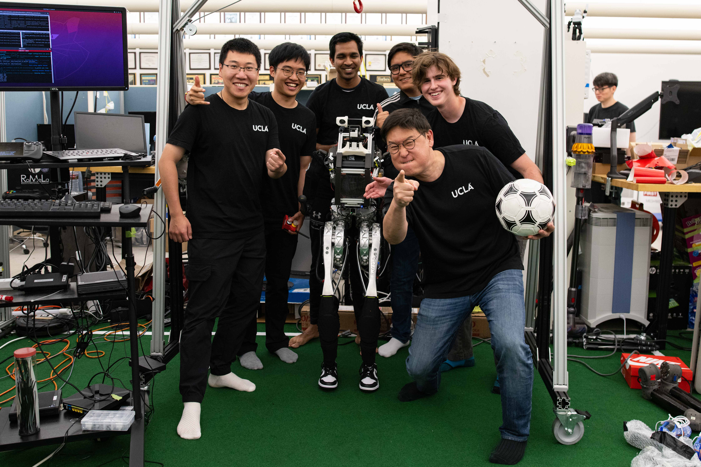
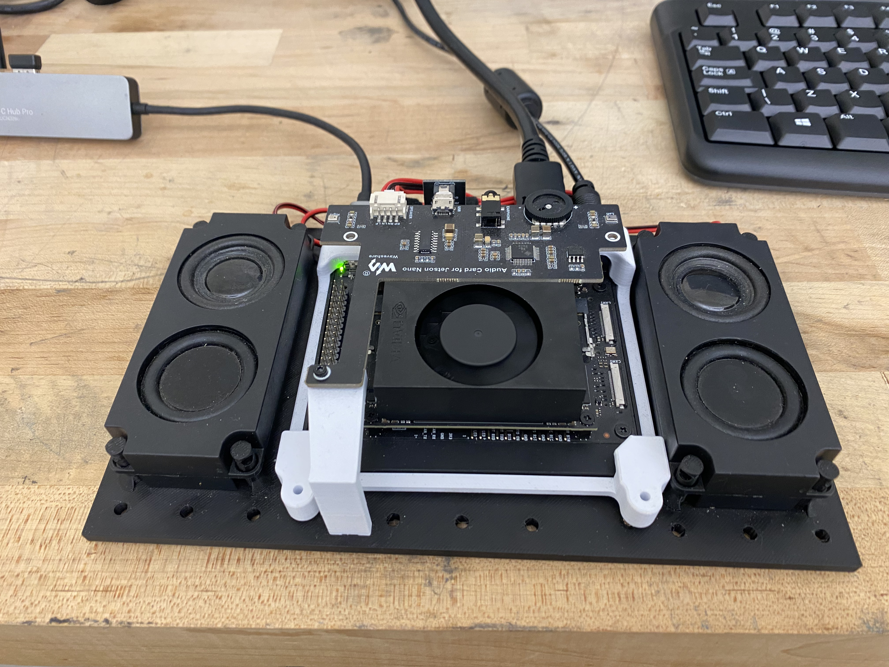

# RoMeLa ChatBots!

## Overview

RoMeLa ChatBots is a specialized conversational AI system being developed for RoMeLa's advanced robotic platforms, including the humanoid robots ARTEMIS and COSMO, DARwIn, and other RoMeLa robots. The system aims to implement a retrieval-based architecture that will enable robots to engage in natural and informative conversations during laboratory demonstrations. By leveraging a knowledge base built from alumni theses and research publications specific to each robot, the system will allow robots to provide accurate, technical responses while maintaining engaging interactions with visitors.

<div align="center">
  
  <p><em>RoMeLa Robot Demo Interaction</em></p>
</div>

<div align="center">
  
  <p><em>Jetson Audio Module, designed to be adapted to small, medium and large form factors </em></p>
</div>

TODOs:
+ Optimize the code:
  - Improve the relative imports in the yaml file
  - Create a pipeline for importing and quantizing models from Hugging Face to make them lightweight for the Jetson Orin Nano
  - Automate this optimization process
+ Restructure the project to make it easier to add new robots as they're built and need to be integrated into the system
+ Create a bash file to automate and unify the installation process. Note: The main environment was derived from this video: https://www.youtube.com/watch?v=6zAk0KHmiGw
+ Implement automatic fetching and loading of new LLMs based on their names (we can check Hugging Face, but models should be compatible with llama.cpp)
+ Automate the creation process in Docker


## System Requirements

- Ubuntu 22.04 LTS
- Python 3.10.12
- CTK 12.6
- nvidia-jetpack (6.0+b106)

## Hardware Components 

- Jetson Orin Nano + Audio Case (if you want us to release the CAD for the cute case, let us know!)
-  [Waveshare Audio Card for Jetson Nano](https://www.waveshare.com/audio-card-for-jetson-nano.htm) - USB audio codec designed specifically for Jetson Nano that provides audio input/output capabilities. We have validated that this can also work for a Jetson Orin Nano.


## Quick Start

### 1. Quick Setup

In the "Sound" tab:

- Ensure the "Output Device" is set to "Speakers - USB PnP Audio Device."
- Ensure the "Input Device" is set to "Microphone - USB PnP Audio Device."

### 2. Environment Setup

Create and activate a Python virtual environment:

```bash
python -m venv venv
source venv/bin/activate
sudo apt-get update && sudo apt-get install -y \
    portaudio19-dev \
    alsa-utils \
    pulseaudio \
    libasound2-dev

sudo apt-get update
sudo apt -y install ffmpeg
sudo apt-get -y install cmake
sudo apt-get -y install python3-pyaudio
sudo apt install -y portaudio19-dev
pip install --global-option='build_ext' --global-option='-I/usr/local/include' --global-option='-L/usr/local/lib' pyaudio 
pip install --upgrade pip
pip install --no-deps -r requirements.txt
sudo apt install -y espeak-ng
```
### 3. Audio System verification
Test your audio setup before running the main application:

```
python ./scripts/audio_mic_test.py
```

### 4. Initial configuration

1. Generate the vector database (first-time setup):
```
python scripts/tokenizer.py
```
Note: Ensure your RAG data is in the data folder before running this command

2. Download an LLM model:
- Select a model compatible with ollama CUDA: https://ollama.com/search
- Write the name of the model in config.yaml in the "model" field

3. Start the application:
```
python main.py 
```
For further reading you can check the `llm_cpp.py` class which is the llm hanlder!

## Docker Deployment

### If we're using Docker

1. Open the Dockerfile and change "data.pdf" to the actual name of your PDF in the "data" folder and comment/uncomment lines as needed for tokenization.

2. Run the following command to build the Docker environment:
```bash
sudo docker build -t chatemis .
```

3. Run the following command to start the Docker environment with required pulseaudio information:
```bash
# Start and run the container
sudo docker start chatemis

sudo docker run -it --rm --privileged --device /dev/snd --runtime nvidia \
  --network=host \
  -e PULSE_SERVER=unix:/run/user/1000/pulse/native \
  -e PULSE_COOKIE=/tmp/pulse_cookie \
  -v /run/user/1000/pulse/native:/run/user/1000/pulse/native \
  -v ~/.config/pulse/cookie:/tmp/pulse_cookie:ro \
  chatemis
```


